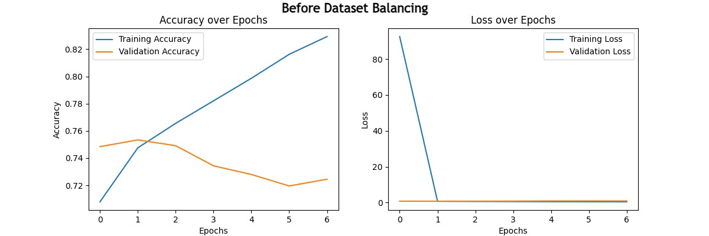
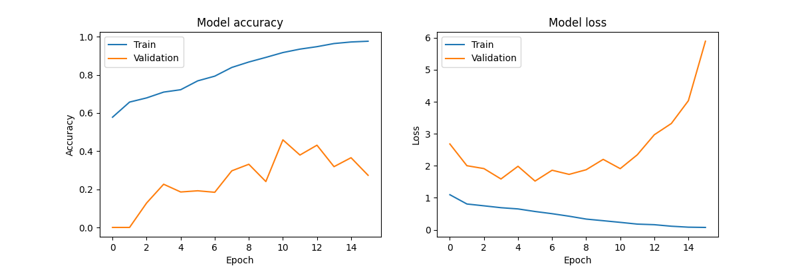
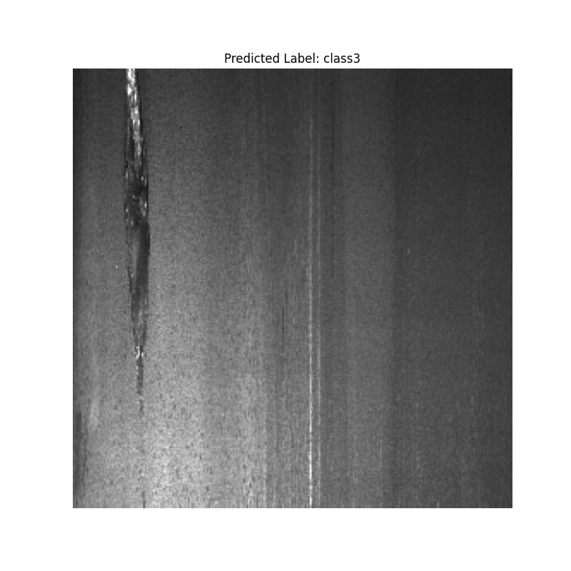
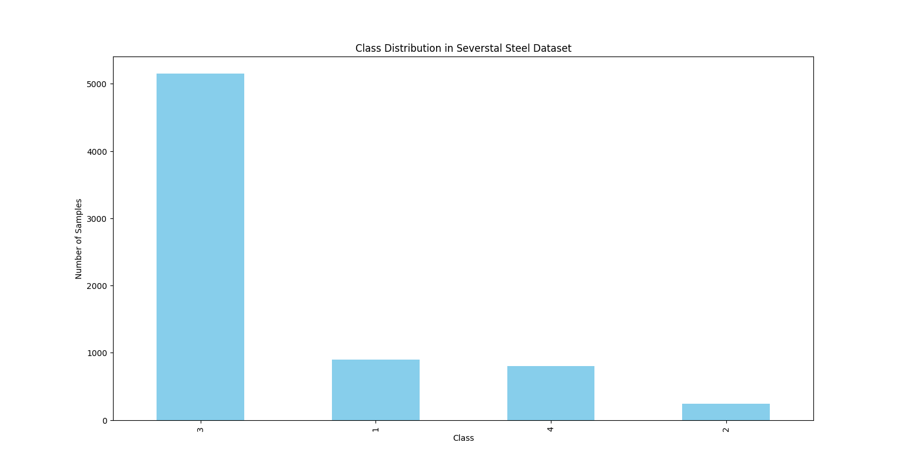
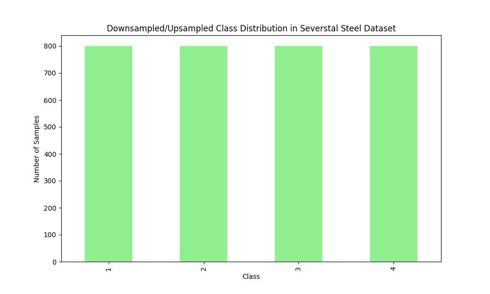
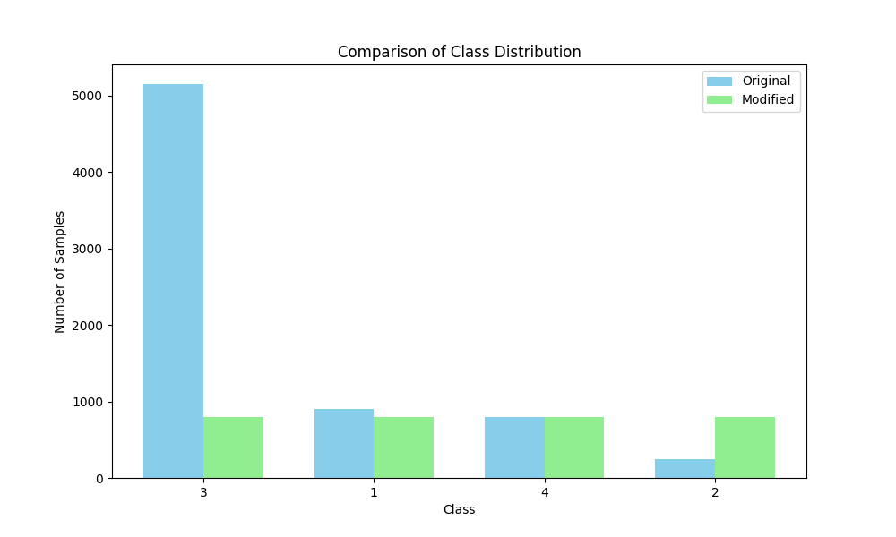

# Steel Defect Detection

## Overview
This project aims to detect defects in Severstal steel images using a deep learning model. The dataset consists of images with various types of defects, and the project includes data preprocessing, model training, evaluation, and visualization of results.

## Project Structure
- **Data/**: Contains image datasets for training, validation, and testing.
  - **train_images.csv/**: Images used for training the model.
  - **test_images.csv/**: Images used for testing the model.

- **scripts/**: Python scripts for preprocessing, training, and evaluation.
  - **PP.py**: Data preprocessing script that prepares images and annotations.
  - **MT.py**: Model training script that trains the model on the dataset.
  - **MS.py**: Model saving script that saves the trained model in Keras format.
  - **IN.py**: Model inference script for making predictions on new images.
  - **CAM_IN.py**: Model evaluation script that generates performance metrics and visualizations.

- **models/**: Contains saved models.
  - **model.keras**: Trained model in Keras format.(!Updating in Progress!)

- **results/**: Contains results from model training and evaluation.
  - **imbalanced_training.png**: Graph showing training and validation accuracy and loss curves of imbalanced dataset.
  - **balanced_training.png**: Graph showing training and validation accuracy and loss curves of balanced dataset.
  - **predicted_output.png**: Example image with predicted defect annotations.
  - **imbalanced_dataset.png**: Graph showing the given raw and imbalanced distribution of the dataset.
  - **balanced_dataset_graph.png**: Graph showing the balanced distribution of the dataset.

## Model Architecture
The model is based on the ResNet50 architecture, a popular deep learning model known for its performance in image classification tasks. It includes:
- **Base Model:** ResNet50 with weights pre-trained on ImageNet.
- **Custom Layers:** Global Average Pooling, Dense layers with ReLU activation, and a final Dense layer with Softmax activation for classification.
- **Frozen Layers:** The layers of ResNet50 are frozen during training to leverage pre-trained features.

## Results
### Accuracy and Loss Curves
- **Imbalanced data training**

This graph illustrates the training and validation accuracy and loss over the epochs of imbalanced dataset.

- **balanced data training**

This graph illustrates the training and validation accuracy and loss over the epochs of imbalanced dataset.

### Predicted Output

An example of an image with defect annotations predicted by the model.

### Dataset Imbalanced Graph

This graph shows the balanced distribution of the imbalanced dataset classes.

### Dataset Balanced Graph

This graph shows the balanced distribution of the balanced dataset classes.

### Comparison After Data Management Of Imbalanced Dataset

This graph shows the comparison of imbalanced and balanced distribution of the balanced dataset classes.

